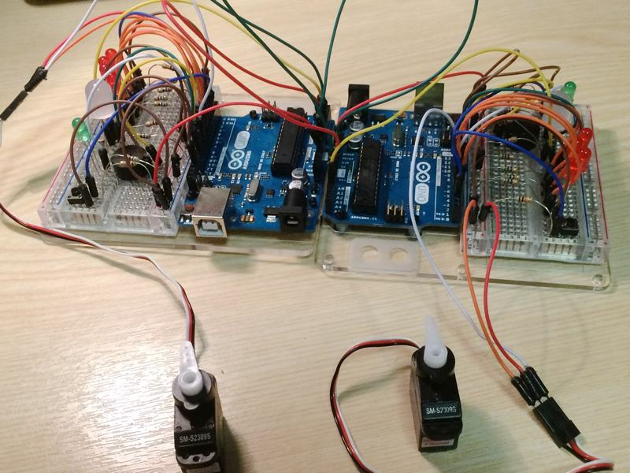
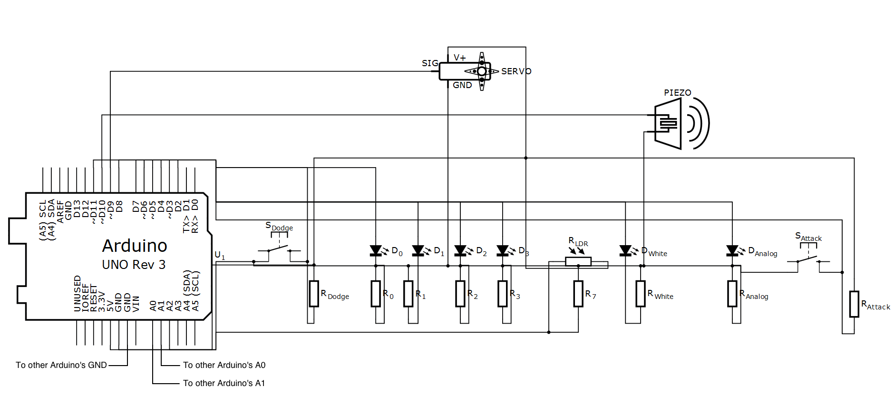

# Arduino Judge
**A game for two Arduinos, by Daniel Barlow and Ben Hetherington.**

Is your piezo higher than their's? Is your LED flashing the fastest? Good! Time to whack them with a hammer! (...metaphorically speaking, of course)

Created as part of our first-year Systems Architecture coursework, we aimed to recreate the excitement of the original *Game & Watch Judge*, but through microgames that revolve around LEDs, piezo speakers, and LDRs.

# The Game:
This game is made up of six microgames. In each microgame, one of the players will be given the opportunity to attack the other player - if that's not you, then dodge before you can be attacked!

If you make the correct move before the other player, you'll get points - but if you make the wrong move, you'll lose them instead.

Your current score is represented by your servo - the further it is to the right, the closer you are to winning!

# Microgames:
- **Piezo Pitch**: Attack if your piezo is playing a higher note!
- **Piezo Rhythm**: Attack if your piezo is playing faster rhythm!
- **LED Number**: Attack if your LEDs are displaying the highest number in binary!
- **LED Brightest**: Attack if your LED is brighter!
- **LED Frequency**: Attack if your LED is flashing faster!
- **LDR Cover**: Don't attack - cover the LDR before your opponent!

# Pins:
- **A0**: Serial RX. *Connect to A1 of the other Arduino.*
- **A1**: Serial TX. *Connect to A0 of the other Arduino.*
- **A2**: Light-dependent resistor.
- **2**: Dodge button.
- **3**: Attack button.
- **4, 5, 7, 8**: A series of LEDs. *Used for the LED Number game.*
- **6**: Variable-brightness LED. *Used for the LED Brightest & Frequency games*
- **9**: Servo.
- **10**: Piezo.
- **11**: Bright (white) LED. *Used for the LDR game.*

If it helps, here's a slightly convoluted schematic:

*Please leave pin **A5** disconnected.*
